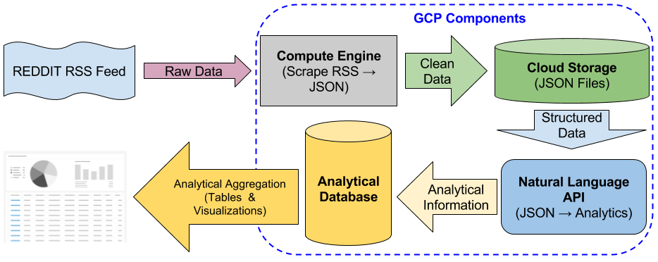
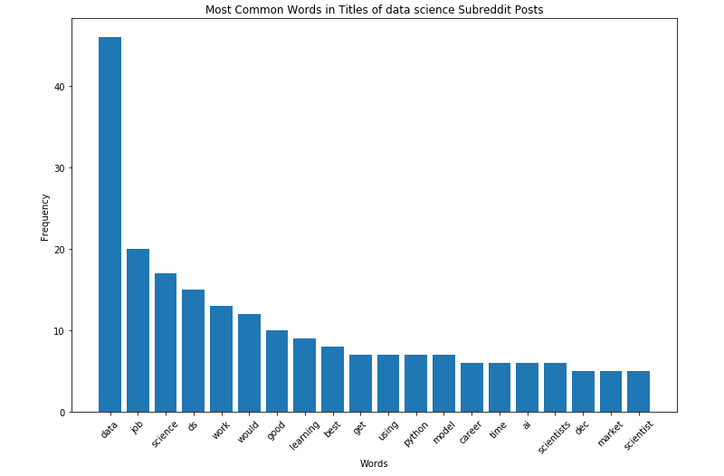
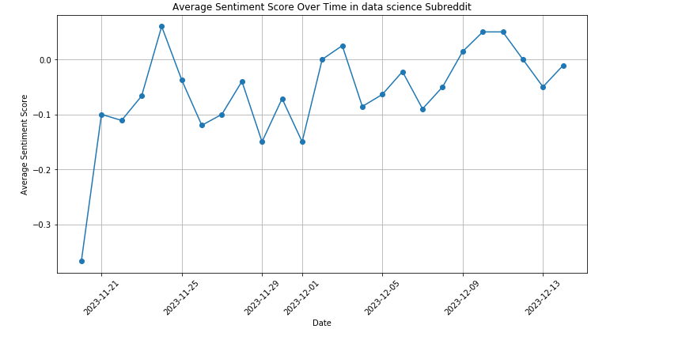
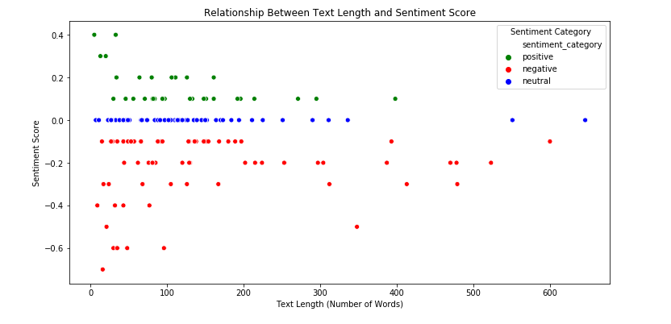

# Sentiment Analysis of Data Science Subreddit Using Google Cloud Platform

## Introduction
This project demonstrates a comprehensive Sentiment Analysis on the Data Science subreddit using Google Cloud Platform (GCP). In the era where Data Science has gained immense popularity, this analysis focuses on evaluating the sentiments of a large volume of posts from the Data Science subreddit. The project encompasses several phases: designing an SQL database on GCP, connecting this database to a storage bucket, utilizing the Google NLP API for sentiment analysis, storing results back in the database, and performing various analyses through programmatic database queries. The following diagram illustrates the project's analytical pipeline:

## Project Overview
- **Database Design**: Utilization of a SQL database to leverage its robust support for structured data and complex querying capabilities.
- **GCP Platforms Used**:
  - **Compute Engine Storage Bucket**: For storing scraped subreddit data.
  - **Google NLP API**: Employed for performing sentiment analysis on each Reddit post.
  - **SQL Alchemy**: Facilitating the connection between the database and Jupyter platform.

## Analytical Process and Visualization
### Database Design
I chose an SQL database for its strong structured data support and complex querying capabilities. The predictable format of Reddit RSS feeds, such as post titles, authors, and timestamps, aligns perfectly with SQL's strengths. The database's relational nature ensures efficient data management and integrity within the cloud environment.

### Data Collection and Storage
Data from the Data Science subreddit was systematically scraped and stored in the GCP Compute Engine Storage Bucket. This data formed the backbone of the analysis, providing real-time insights into trends and sentiments in the data science community.

### Sentiment Analysis Using Google NLP API
Each post was analyzed using the Google NLP API, which assigned a sentiment score, aiding in the quantitative assessment of community sentiments.

### Visualizing Data Science Discussions
- **Common Words in Data Science Subreddit**: A graphical representation of the most commonly used words, offering insights into prevalent topics and trends.
  
  

- **Sentiment Changes Over Time**: An analysis of how sentiments about data science have evolved, visualized through a dynamic timeline.

  

- **Text Length vs. Sentiment Score**: Exploring the relationship between the length of posts and their sentiment scores.

  

## Key Insights and Conclusions
- **Prevalent Discussions**: The most frequent words, "data" and "job," highlight a focus on career discussions, reflecting the subreddit's alignment with data science trends and job opportunities, especially in the USA.
- **Sentiment Patterns**: Shorter posts often show negative sentiments, while longer ones display a mix of negative and neutral tones. This pattern suggests that post length is a significant factor in the sentiment expressed.
- **Community Engagement**: The analysis underscores the community's active engagement with both technical and career-related discussions, as seen in the frequent usage of terms like "python," "model," and "learning."

## Future Work
- **Deeper Sentiment Analysis**: Further studies could explore the context behind the sentiments, particularly in longer posts.
- **Topic Modeling**: Implementing NLP techniques to identify and categorize primary discussion topics within the subreddit.
- **Real-Time Analysis**: Developing a real-time sentiment analysis dashboard for ongoing monitoring of subreddit discussions.

---

